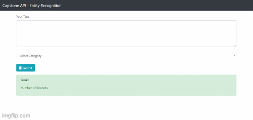

# Name Entity Recognition - Flask API

This is my fist capstone project at Algoritma School of Data Sciece. In this project I created a Name Entity Recognition API to identify different entities in text and categorize them into pre-defined classes or types such as: person, geopolitical, organization, money, and organization.

Live Demo : https://app-ner-flask-api.herokuapp.com/

# NER FLASK API - Behind The Scene

NER FLASK API was built in [Python](https://www.python.org/) , an open source programming language using the [Flask framework](https://shiny.rstudio.com). In order to develop NER FLASK API and we suggest the use of [Jupyter Notebook](https://jupyter.org/). Python is completely free to use. All required code and library used can be found in this github repositroy.
